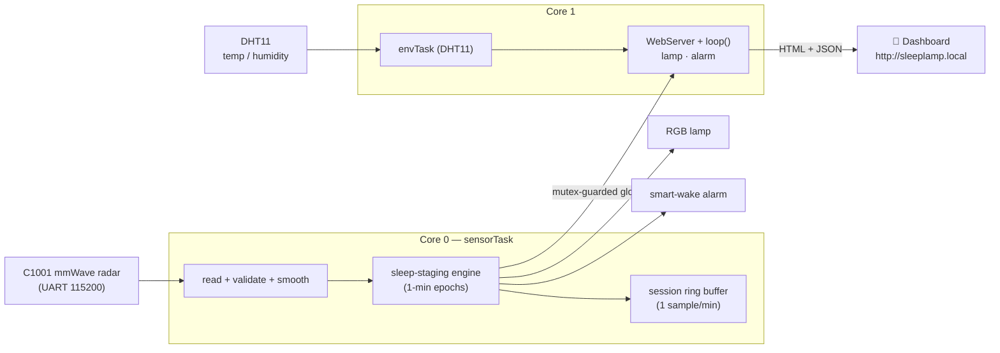
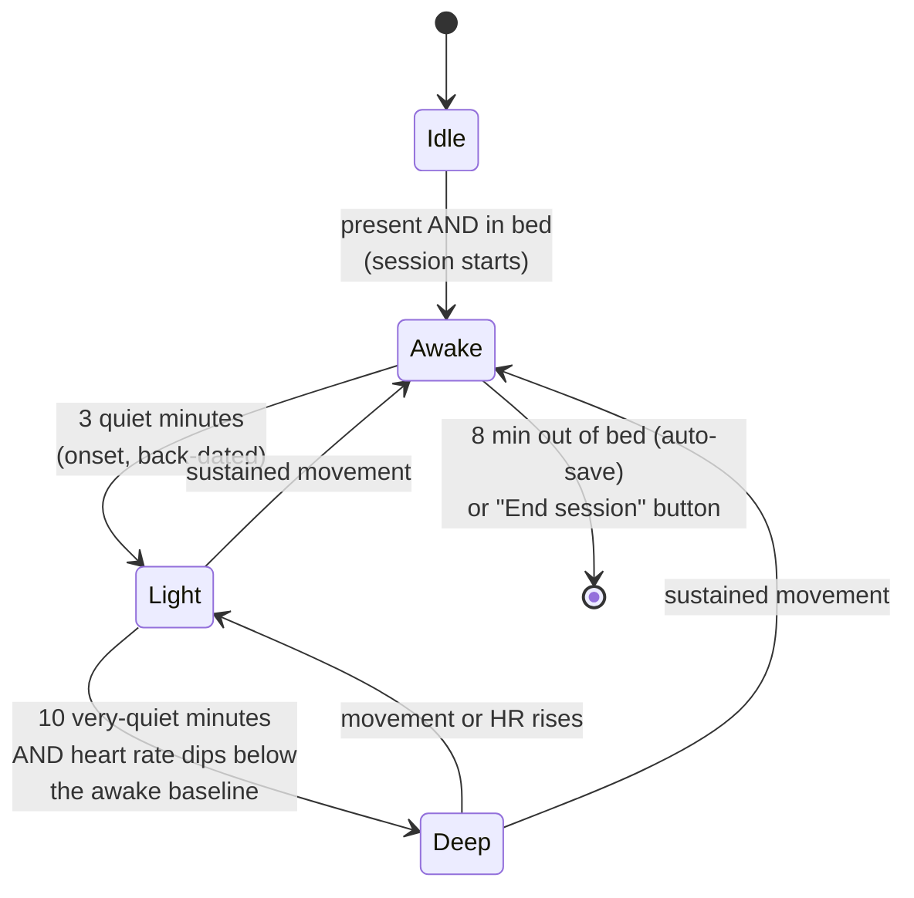
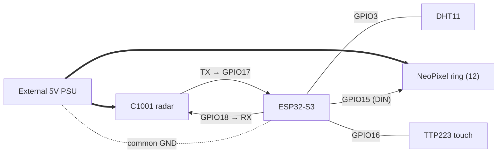

<h1 align="center">SleepLamp</h1>

<p align="center">
  <b>A bedside lamp that tracks your sleep without touching you.</b><br>
  60&nbsp;GHz mmWave radar + ESP32-S3 → sleep stages, heart rate, breathing, and a
  full web dashboard at <code>http://sleeplamp.local</code> — no wearable, no camera, no cloud.
</p>

<p align="center">
  
  
  
  
</p>

---

## Table of contents

- [What is SleepLamp?](#what-is-sleeplamp)
- [See it in action](#see-it-in-action)
- [Feature tour](#feature-tour) — *what each feature does*
- [How it works](#how-it-works) — *the teaching part: architecture & the algorithm*
- [Hardware & wiring](#hardware--wiring)
- [Build & flash it yourself](#build--flash-it-yourself)
- [Using the dashboard](#using-the-dashboard)
- [HTTP API reference](#http-api-reference)
- [Project structure](#project-structure)
- [Build log](#build-log--things-that-bit-me) — *the war stories*
- [Roadmap](#roadmap)
- [Credits & license](#credits--license)

---

## What is SleepLamp?

Most sleep trackers are watches or rings you have to wear and charge. **SleepLamp**
sits on your nightstand and watches you breathe — literally. A **60 GHz millimetre-wave
radar** (DFRobot C1001 / SEN0623) bounces a tiny radio signal off your chest and reads
the micro-movements of your **heartbeat and breathing** from up to ~1.5 m away. An
**ESP32-S3** turns that into live sleep stages, a nightly score, and a polished
"deep-space" web dashboard you open from any phone or laptop on your WiFi.

> **Inspiration:** this project benchmarks against the commercial *Sleepal AI Lamp*
> Kickstarter. SleepLamp is an independent, open-source build — not affiliated with it.

**Why it's interesting**

- **Truly contactless** — nothing to wear, charge, or remember.
- **Real biometrics** — heart rate (bpm) and respiration (rpm) from radar, not estimates.
- **Works on naps** — a custom on-device staging engine reports from minute one (the
  radar's own staging needs 15–20 min; see [How it works](#how-it-works)).
- **100% local** — the dashboard is served straight off the ESP32. No app, no account,
  nothing leaves your network.

---

## See it in action

> 📷 These pull from [`docs/images/`](docs/images/). They'll show as broken icons
> until you drop in real captures from your own lamp — see that folder's README.

| Dashboard & score | Sleep-stage hypnogram |
|---|---|
|  |  |

| Night report | History (per-session, deletable) |
|---|---|
|  |  |

---

## Feature tour

### 🌙 Contactless sleep staging
SleepLamp classifies every minute as **Awake · Light · Deep** using body movement and
vitals from the radar. A session starts automatically when you're present and in bed,
and ends when you get up. No button presses required.

### ❤️ Live vitals
Heart rate and breathing rate stream live, smoothed to kill radar jitter. The dashboard's
two dots literally **pulse at your measured rate** — the heart dot beats at your bpm, the
breath dot at your rpm.

### 📊 Interactive hypnogram
A clean Awake/Light/Deep timeline. **Hover or tap any bar** and it tells you exactly when
that stage started, when it ended, and how long it lasted (e.g. *"Deep sleep · 02:14 – 02:46
· lasted 32m"*). Flip back through earlier nights with the **◀ ▶ arrows**, or hit the little
**calendar icon** and jump straight to any date you've slept and recorded. Chips underneath
keep the per-stage totals in view.

### 📝 Night report + smart insight
When a session ends, SleepLamp builds a full report: total sleep, efficiency, deep/light
split, awakenings, turnovers, average HR/respiration, apnea events, and a **0–99 sleep
score**. A rule-based coach adds one plain-English insight ("It took 38 min to fall
asleep — try winding down earlier").

### 🗂️ Organized history (each session deletable)
Every finished night is saved on the lamp's flash (last 60 kept). The History view shows
a stats strip (sessions, 7-night averages, best night), then a scannable list — each row
has a colored score badge, a *Today/Yesterday* tag, a one-line summary, and a
deep/light/awake composition bar. **Tap to expand for full detail and a per-session
delete button.** Download everything as CSV, or clear all.

### 💡 Status-colour lamp (12-LED NeoPixel ring)
In Auto mode the ring quietly tells you what the radar sees:

- **dim white** — nobody home, just watching the room
- a short **red pulse at your live BPM** the instant it locks onto your heartbeat (the "yes,
  I've got you" cue)
- **green** — you're up and your vitals are locked
- **blue** — you're in bed, settling
- **off** — asleep, because a bedroom should be dark; a faint **amber night-light** kicks in
  only if you get up mid-session for the inevitable 3 a.m. bathroom trip

Prefer a plain bedside lamp? Tap it into manual (or use the dashboard) and it's just warm light
on a brightness slider.

### 👆 One-tap control (TTP223 touch)
One pad, one gesture, everything reachable: each tap steps the lamp
**Auto → Dim 20% → Med 60% → Max 100% → Off → Auto → …**. "Auto" hands the ring back to the
status colours above; the middle three are a plain warm lamp. When the sunrise alarm is going
off, any tap silences it. (Getting this pad to behave took a couple of nights —
see [Build log](#build-log--things-that-bit-me).)

### ⏰ Smart-wake sunrise alarm
Set a wake time and a window (say 30 min). SleepLamp watches for **light sleep** inside
that window and starts a gradual **sunrise light ramp** to wake you gently at the easiest
moment — never yanking you out of deep sleep. Get out of bed (or tap the lamp) and it stops.

### 🏠 Matter (built, then shelved — being honest)
The lamp *is* a full **Matter Color Light** under the hood — pairing QR, two-way state sync,
the lot — but it ships **off** (`ENABLE_MATTER 0`). On real hardware it brought two problems I
wasn't willing to leave in: a colour-control feedback loop that kept dragging the lamp down to
1 % brightness ("touch only turns it off" was actually this), and an mDNS clash with
`sleeplamp.local` that stopped Matter from ever advertising. I fixed the feedback loop; the
mDNS clash I haven't, so it stays disabled for now. The whole thing is still sitting in
[`Matter.ino`](firmware/sleeplamp/Matter.ino) if you want to finish it — and turning it off
handed ~82 KB of heap back to the dashboard, which wasn't the worst trade.

### 🪐 "Deep-space universe" dashboard
A single self-contained page served from the ESP32: nebula glow, drifting starfields,
shooting stars, a ringed planet, glassmorphism cards, a glowing score ring, scroll
progress bar, toasts, and a back-to-top button. Installable as a PWA on your phone.

---

## How it works

### System architecture

Two FreeRTOS tasks run on the ESP32-S3's two cores so a slow or rebooting radar can
**never** freeze the web UI:



- **`sensorTask` (core 0)** owns the radar UART exclusively — init, recovery, and feeding
  the staging engine — so HTTP traffic never collides with sensor reads.
- **`loop()` + WebServer (core 1)** serve the dashboard and drive the lamp/alarm.
- Shared state lives in **mutex-guarded globals**, so the web layer always reads a
  consistent snapshot.

### The sleep-staging engine (the clever bit)

The C1001's *built-in* staging needs **15–20+ minutes** of in-bed data before it reports
anything, and its nightly-stats frame arrives only once per night — useless for naps, and
corrupt frames used to flood the history with junk (HR 2 bpm, apnea 56…). So SleepLamp
**stages sleep itself**, one minute at a time, from movement + vitals:



Each **1-minute epoch** is scored from:
- **mean movement** + how often movement *spikes* (as a % of the epoch, so the thresholds
  hold regardless of timing),
- **heart rate** vs a learned *awake-in-bed baseline* (deep sleep requires the HR to drop).

The **sleep score (1–99)** blends four factors:

| Weight | Factor | Target |
|:--:|---|---|
| 45% | Sleep efficiency (asleep ÷ in-bed) | high |
| 25% | Deep-sleep share | ~25% |
| 15% | Total duration | ~7 h |
| 15% | Few awakenings | fewer is better |

Sessions are written to history **only** by the engine at session end — never from raw
radar frames — which is why the junk-data problem is gone for good.

### Why a custom engine instead of the radar's?

| | Radar's built-in staging | SleepLamp engine |
|---|---|---|
| First result | after 15–20 min | from **minute 1** |
| Works for naps | ✗ | ✓ |
| Junk-frame proof | ✗ (HR 2 bpm, apnea 56) | ✓ (validated writes only) |
| On-demand report | ✗ (once/night) | ✓ ("End session" anytime) |

---

## Hardware & wiring

### Bill of materials

| Part | Notes |
|---|---|
| **ESP32-S3-WROOM-1 N16R8** dev board | 16 MB flash, 8 MB PSRAM. The brains. |
| **DFRobot C1001 / SEN0623** 60 GHz mmWave sensor | The contactless radar. |
| **DHT11** temp/humidity sensor | Bedroom climate (bit-banged, no library). |
| **NeoPixel ring — 12× WS2812/SK6812** | The adaptive lamp (one data wire). |
| **TTP223 capacitive touch module** | Tap to toggle the lamp / dismiss the alarm. |
| **External 5 V supply** (≥1.5 A, clean) | **Required** — radar + ring; see the gotcha below. |

### Wiring

| Signal | ESP32-S3 pin | Power |
|---|:--:|---|
| C1001 **TX** → ESP RX | **GPIO 17** | VCC → **external 5 V** (not USB 5 V), common GND |
| C1001 **RX** ← ESP TX | **GPIO 18** | — |
| NeoPixel ring **DIN** | **GPIO 15** | 5 V + GND from the **external supply** (≈0.7 A @ 12 px) |
| TTP223 touch **OUT** | **GPIO 16** | VCC → **3V3** |
| DHT11 **DATA** | **GPIO 3** | VCC → **3V3** — *keep the data pull-up; GPIO3 is a strapping pin* |

These are just `#define`s in [config.h](firmware/sleeplamp/config.h) — mine ended up here because
of how my PCB routed. Wire it however suits your board and change them there.

> **If the radar never answers** (`init error, retrying` forever): swap **TX ↔ RX**. UART
> cross-over trips up *everyone*, me included — my board was wired the mirror image of the
> defaults and the sensor stayed dead silent until I flipped these two lines.



### ⚠️ Critical gotcha — radar power & the HR lock

Heart rate and breathing **only** appear when **all** of these are true:
1. The person is **still**, chest **0.5–0.8 m** from and **facing** the sensor.
2. Breathing is slow and steady.
3. The radar has **clean external 5 V** — the board's USB 5 V rail is too noisy and
   causes *no HR lock + corrupt UART frames + brownout reboots*.

A few `init error, retrying` lines for the first ~10–15 s after power-on are **normal**
(the radar takes that long to boot). If a lock won't hold, hit **Recalibrate sensor** on
the dashboard or power-cycle the radar's 5 V.

---

## Build & flash it yourself

### 1. Install the toolchain
- **Arduino IDE 2.x**
- **esp32 board package 3.1.x or 3.2.x** (Boards Manager → "esp32" by Espressif). Matter ships
  **off**, so any recent 3.x builds fine — you'd only need 3.1+ specifically if you re-enable it.
- **Adafruit NeoPixel** library (Library Manager → "Adafruit NeoPixel", **≥ 1.12.3**,
  tested 1.15.5) — drives the ring.
- **No sensor library to install** — the radar driver is bundled with the sketch as a
  single file, [`firmware/sleeplamp/ShubhSensor.h`](firmware/sleeplamp/ShubhSensor.h).
  It's the DFRobot C1001 driver merged into one header and patched (non-blocking cached
  reads, crash fixes for corrupt frames). The sketch is fully self-contained.

### 2. Set your WiFi (kept off GitHub)
```bash
cd firmware/sleeplamp
cp secrets.example.h secrets.h      # then edit secrets.h with your WiFi
```
`secrets.h` is git-ignored, so your password never leaves your machine. *(Don't have it
handy? Skip this — flash anyway and set WiFi from the `SleepLamp-Setup` hotspot,
password `sleeplamp123`, at `http://192.168.4.1/wifi`.)*

### 3. Board settings (Arduino IDE → Tools)
| Setting | Value |
|---|---|
| Board | **ESP32S3 Dev Module** |
| Flash Size | **16 MB (128 Mb)** |
| Partition Scheme | **Huge APP (3 MB No OTA / 1 MB SPIFFS)** — the binary is ~1.1 MB, so the default 1 MB scheme won't fit (you'll get *"text section exceeds available space"*) |
| PSRAM | **Disabled** is fine. The N16R8's 8 MB OPI PSRAM sits idle for now — snore detection is the feature that'll finally earn it a job. |

### 4. Flash & open
Open `firmware/sleeplamp/sleeplamp.ino`, upload, then browse to
**http://sleeplamp.local**. On the very first run an RGB boot test cycles
**Red → Green → Blue** so you can verify your LED wiring.

> **Edits not reaching the chip?** Clear the IDE cache: delete
> `%LOCALAPPDATA%\arduino\sketches` and re-upload.

---

## Using the dashboard

Open **http://sleeplamp.local** on any device on the same WiFi.

- **Sleep score & current state** at the top, with live vitals.
- **Sleep Stages** — the interactive hypnogram (hover/tap the bars).
- **Tonight** — live session counters + an **End session & save report** button.
- **History** — expand any night for detail; delete sessions individually or clear all;
  **Download CSV**.
- **Lamp** — Auto / Manual / Off, color presets, brightness.
- **Smart Wake** — set time + light-sleep window.
- **Device & Setup** — placement check, change WiFi, OTA firmware update, factory reset.

**Check Placement** is the handy onboarding tool — it walks you through getting all four
green checks (presence → still → breathing → heart rate) so you find the sweet spot.

---

## HTTP API reference

Everything the dashboard uses is a plain HTTP endpoint you can curl or script:

| Endpoint | Purpose |
|---|---|
| `GET /api/data` | Live JSON snapshot (vitals, state, live session, last report) |
| `GET /api/session` | Tonight's per-minute stage/HR/breath arrays (the hypnogram) |
| `GET /api/history` | All saved sessions (JSON array, oldest first) |
| `GET /api/history?del=N&t=STAMP` | Delete one session (index + timestamp guard) |
| `GET /api/history?clear=1` | Delete all sessions |
| `GET /api/export` | Download `sleeplamp_history.csv` |
| `GET /api/report?end=1` | End the current session now and save its report |
| `GET /api/light?mode=&r=&g=&b=&bright=` | Control the lamp |
| `GET /api/alarm?en=&h=&m=&win=` | Configure the smart-wake alarm |
| `GET /api/sensor?reset=1` | Recalibrate the radar |

---

## Project structure

```
SleepLamp_Project/
├─ README.md                  ← this file
├─ LICENSE                    ← MIT
├─ docs/                      ← banner + screenshots
├─ research/                  ← deep-dive notes (sensor, product analysis, architecture/BOM)
├─ datasheets/                ← C1001/SEN0623 reference
└─ firmware/
   ├─ sleeplamp/              ← ★ the product firmware (open sleeplamp.ino)
   │  ├─ sleeplamp.ino        ← globals, setup(), loop(), telemetry
   │  ├─ config.h             ← pins, engine constants, history cap, feature flags
   │  ├─ secrets.example.h    ← copy → secrets.h (git-ignored) for WiFi
   │  ├─ types.h              ← shared data model + globals + prototypes
   │  ├─ ShubhSensor.h        ← bundled single-file C1001 radar driver (no install needed)
   │  ├─ Sensor.ino           ← C1001 radar task (core 0) + session recorder
   │  ├─ Sleep.ino            ← the sleep-staging engine
   │  ├─ Env.ino              ← DHT11 task (core 1)
   │  ├─ Light.ino            ← NeoPixel ring lamp: adaptive + sunrise
   │  ├─ Touch.ino            ← TTP223 touch button
   │  ├─ Alarm.ino            ← NTP time + smart-wake alarm
   │  ├─ Matter.ino           ← Matter color light (smart-home pairing)
   │  ├─ Store.ino            ← history (save / list / delete / export)
   │  ├─ Api.ino              ← read-only JSON endpoints (data, session)
   │  ├─ Control.ino          ← control endpoints (light, alarm, report, sensor)
   │  ├─ WebUI.ino            ← serves the dashboard page + PWA manifest
   │  ├─ Settings.ino         ← persist lamp/alarm in NVS
   │  ├─ Provision.ino        ← WiFi portal, OTA update, factory reset
   │  └─ page_head/css/body/js.h ← dashboard split into 4 streamed PROGMEM parts
   ├─ sleeplamp_core/         ← minimal serial-only vitals reader (sensor bring-up)
   ├─ c1001_s3_test/          ← minimal S3 vitals test
   ├─ c1001_uart_diag/        ← raw UART frame sniffer
   └─ c1001_demo/             ← classic ESP32 basics demo
```

---

## Build log — things that bit me

None of this came out clean. A few of the fights, in case you're about to have the same ones:

**The radar played completely dead.** `begin()` looped `init error` forever with wiring that
"obviously" matched the datasheet. Classic UART cross-over — my board had TX and RX mirrored
from the defaults, and the sensor stayed dead silent until I swapped the two lines in `config.h`.
If yours won't answer, try this *first*, not last.

**The lamp turned itself off at 3 a.m.** For two nights the light flicked off on its own. The
TTP223's output was floating, so electrical noise kept firing phantom "taps." An
`INPUT_PULLDOWN` plus a 40 ms level-debounce — the pin now has to *hold* a new state before a
tap counts — and the ghost was gone.

**Only 5 of 12 LEDs lit, and white instead of warm.** Looked like a data-line bug; it was power.
Twelve WS2812s at full white pull ~0.7 A, and a laptop USB port sags under that, browning out
both the ring and the radar. Clean external 5 V (never the board's USB rail) fixed the colours
*and* stopped the random reboots.

**Matter kept dragging the lamp to 1 % brightness.** Every colour change I pushed to the hub
echoed back as a "command," round-tripped RGB → HSV → RGB, and landed on near-black. That was the
real reason "touch only turned it off." A self-write guard broke the loop — though an unrelated
mDNS clash still keeps Matter parked (see above).

**The radar poisoned its own history.** The C1001's built-in staging reports once a night, and
its corrupt frames wrote nonsense into history — HR of 2 bpm, 56 apnea events a night. So the
lamp stages sleep itself and only ever writes *validated* data at session end. Junk gone for
good.

**OneDrive ate my edits.** The sketch lived in a OneDrive folder, which quietly spawned `-Shubh`
conflict copies mid-build — my changes compiled into a ghost file while the original reverted
under me. If you value your sanity, keep the source somewhere the cloud can't "help."

---

## Roadmap

- [x] **NeoPixel ring lamp** (12× WS2812) with adaptive + sunrise lighting.
- [x] **Touch control** (TTP223).
- [x] **Matter** color light — coded and working, but currently shelved over an mDNS clash
      (see the Matter note in the [feature tour](#feature-tour)).
- [ ] **Fix that mDNS clash** and switch Matter back on.
- [ ] **Snore detection** — I²S MEMS mic + a small TensorFlow Lite Micro model
      *(the feature that will finally justify turning on the S3's PSRAM)*.
- [ ] Ambient light sensor (BH1750) for smarter auto-brightness.
- [ ] Native mobile app + optional cloud sync.
- [ ] Finished 3D-printed enclosure.

---

## Credits & license

- **Radar driver:** `ShubhSensor.h` — the C1001 driver merged into a single file and
  patched (non-blocking cached reads + corrupt-frame crash fixes) by **Shubh Jaiswal**.
  It is built on DFRobot's [DFRobot_HumanDetection](https://github.com/DFRobot/DFRobot_HumanDetection)
  library (© 2010 DFRobot, MIT) — original copyright retained as the license requires.
- **Sensor:** DFRobot C1001 / SEN0623 —
  [wiki](https://wiki.dfrobot.com/SKU_SEN0623_C1001_mmWave_Human_Detection_Sensor).
- Built with the Arduino-ESP32 core.

This project's own code is released under the **[MIT License](LICENSE)**. Inspired by the
*Sleepal AI Lamp*; independent and unaffiliated.
